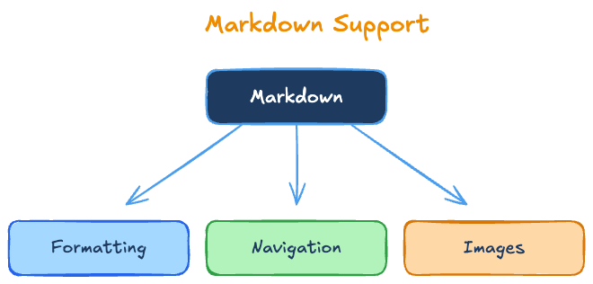

# Hello!

Press `Tab/Shift-Tab` to select below links and `Enter` to open:

- [Introduction](#introduction)
- [Navigation](#navigation)
- [Multiple entry](#multiple-entry)
- [Configure plugins](#configure-plugin)
- [Features](#features)
- [git managed](#git-managed)
- [Markdown format](#rich-markdown-format)
  - [Headings](#headings)
  - [Emphasis](#emphasis)
  - [Lists](#lists)
  - [Blockquotes](#blockquotes)
  - [Inline Code](#inline-code)
  - [Code Blocks](#code-blocks)
  - [Tables](#tables)
  - [Task Lists](#task-lists)



## Introduction

This is a wiki-style documentation called `doki` saved as Markdown files alongside the project
Since they are stored in git they are versioned and all edits can be seen in the git history along with the timestamp
and the user. They can also be perfectly synced to the current or past state of the repo or its git branch

This is just a sample entry point. You can modify it and add content or add linked documents 
to create your own wiki style documentation

## Navigation

Press `Tab/Enter` to select and follow this [link](linked.md) to see how. 
You can refer to external documentation by linking an [external link](https://raw.githubusercontent.com/boolean-maybe/navidown/main/README.md)

## Multiple entry

This is just a single example, but you can also create multiple entry points such as:
- Brainstorm
- Architecture
- Prompts

## Configure plugin

Just configuring multiple plugins. Create a file like `brainstorm.yaml`:

```text
        name: Brainstorm
        type: doki
        foreground: "##ffff99"
        background: "#996600"
        key: "F6"
        url: new-doc-root.md
```

and place it where the `tiki` executable is. Then add it as a plugin to the tiki `config.yaml` located in the same directory:

```text
        plugins:
            - file: brainstorm.yaml
```

## Features
- [x] stored in git and always in sync
- [x] built-in terminal UI
- [x] AI native
- [x] rich **Markdown** format

## Git managed

`dokis` (short for documents) are just **Markdown** files in your repository

```
/projects/my-app
├── .doc/
│   └── doki/
│       ├── index.md
│       ├── getting-started.md
│       ├── installation.md
│       └── architecture.md
├── src/
│   ├── components/
│   │   ├── Header.tsx
│   │   ├── Footer.tsx
│   │   └── README.md
│   └── ...
├── README.md
├── package.json
└── LICENSE
```

## Rich Markdown format

Since dokis are just **Markdown** files you can use all of its rich formatting options

### Headings

# H1 Heading
## H2 Heading
### H3 Heading
#### H4 Heading

### Emphasis

**bold text**
*italic text*
***bold and italic***

### Lists

Unordered:
- Item 1
- Item 2
  - Nested item

Ordered:
1. First item
2. Second item
   1. Nested item

### Blockquotes

> This is a blockquote
> It can span multiple lines
>
> > Nested blockquotes are also possible

### Inline Code

Use `backticks` to highlight code within text.
Variables like `userName` or functions like `getData()` stand out.

### Code Blocks

python:
```python
def hello_world():
    print("Hello, World!")
```

JavaScript:
```javascript
const greeting = "Hello, World!";
console.log(greeting);
```

### Tables

| Column 1 | Column 2 | Column 3 |
|----------|----------|----------|
| Cell 1   | Cell 2   | Cell 3   |
| Cell 4   | Cell 5   | Cell 6   |

| Left aligned | Center aligned | Right aligned |
|:-------------|:--------------:|--------------:|
| Left         | Center         | Right         |

### Task Lists

- [x] Completed task
- [ ] Incomplete task
- [ ] Another task to do
  - [x] Nested completed task
  - [ ] Nested incomplete task